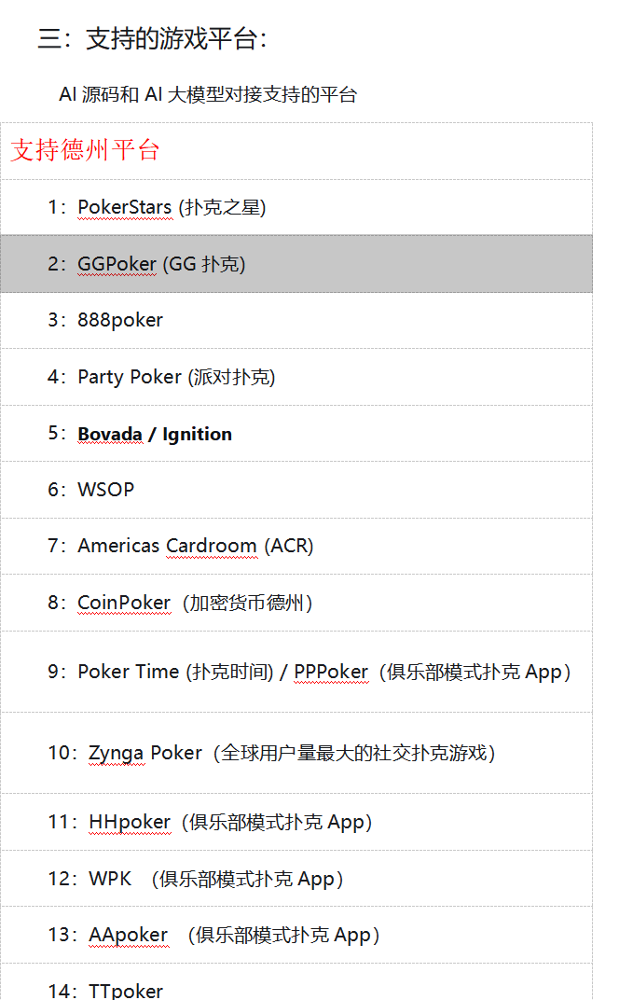
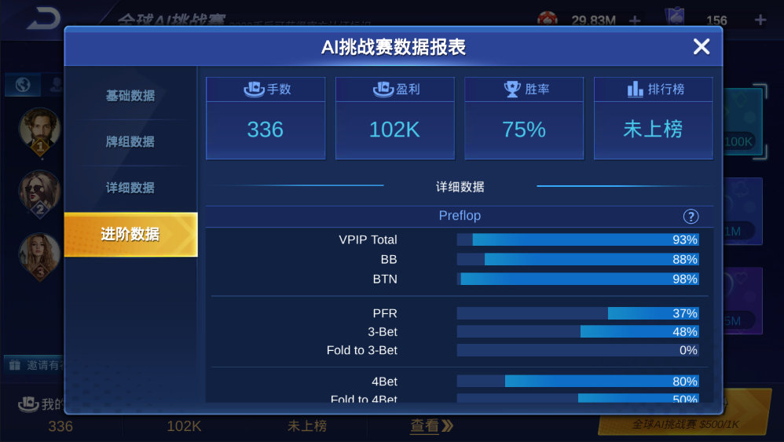
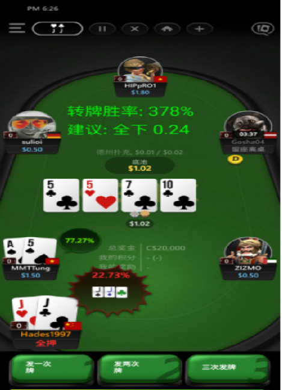

[简体中文](README.md) | [繁體中文](README.zh-TW.md) | [English](README.en.md)

# Poker GTO Trainer Source Code

Poker GTO Trainer is a Texas Hold'em AI training and decision-analysis source-code project based on CFR-style strategy learning, deep neural networks and real-time decision APIs. It is designed for strategy research, AI sparring, decision visualization, product demos and authorized secondary development.

## Read and Download

- Read this README first to understand GTO training, AI decisions, CFR algorithms, model training, API integration and customization scope.
- Product screenshots are loaded from the verified repository path `docs/assets/Screenshots/`. Keep `assets` lowercase, `Screenshots` with an uppercase S, and keep every file name unchanged.
- For source-code evaluation, demo builds, deployment guidance or custom development, contact the maintainer by Email or Telegram.

## Product Screenshots

## Overview

The project supports heads-up and multi-player Texas Hold'em training scenarios, self-play reinforcement learning, strategy evaluation, opponent modeling, model export and real-time action suggestions. It can be used to study GTO concepts, build poker AI demos, integrate decision APIs, or create internal training tools.

## Key Features

- GTO strategy learning with iterative CFR-style training.
- Heads-up and multi-player Texas Hold'em decision analysis.
- Millisecond-level decision output for Fold, Call and Raise actions.
- Self-play training, model evaluation and strategy visualization.
- Python / C++ API integration for research and product prototypes.

## Technology Stack

- C++17 for high-performance calculation modules.
- Python 3.10+ and PyTorch for model training and evaluation.
- gRPC / Protobuf style API design for decision services.
- Redis or cache modules for state synchronization when needed.

## Responsible Use

This project is intended for lawful AI research, strategy learning, product demonstration, private deployment and authorized secondary development. Users are responsible for complying with local laws, platform policies and applicable regulations.

## Contact

- Email: ttpoker40@gmail.com
- Telegram: @alibabama401
